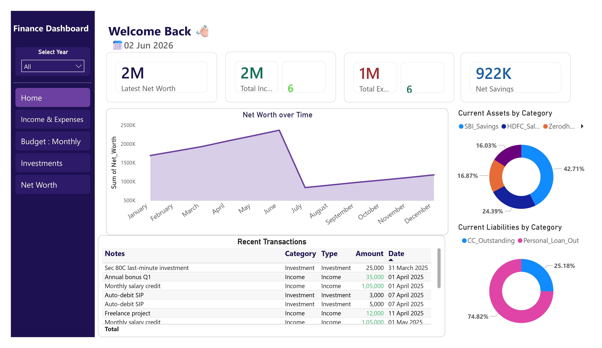
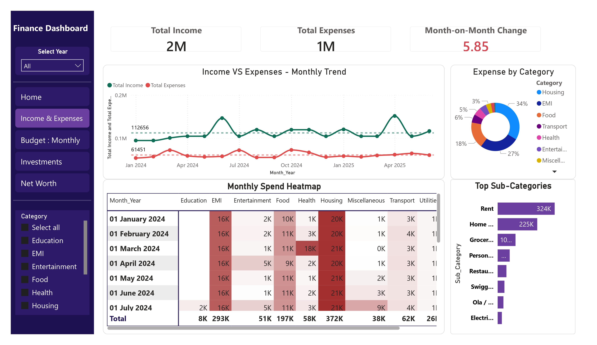
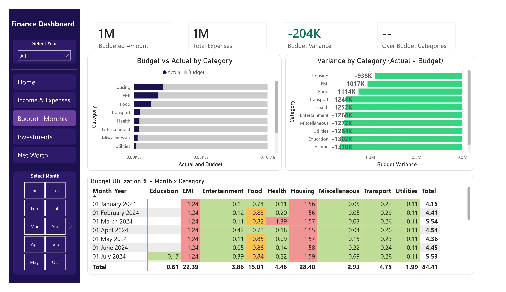
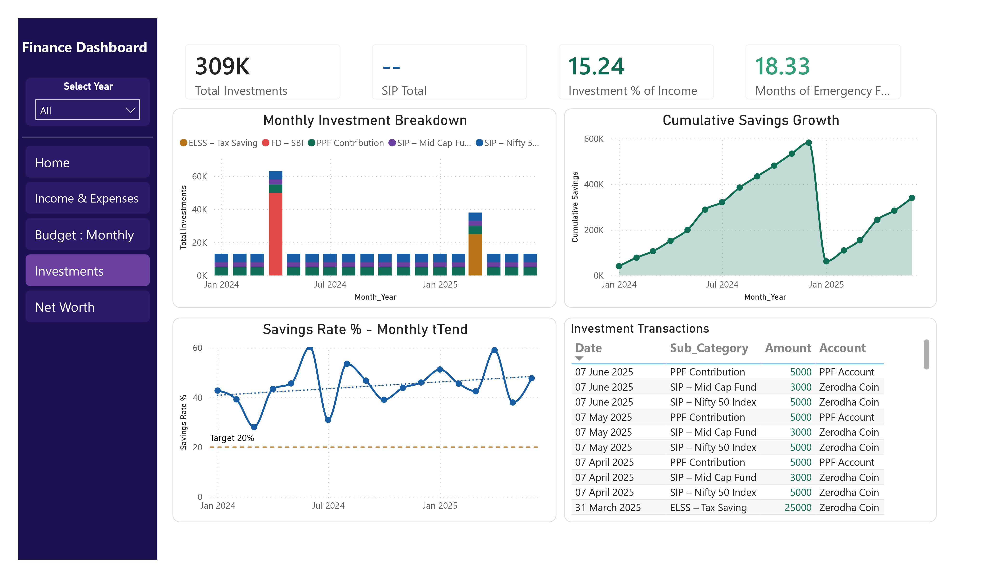
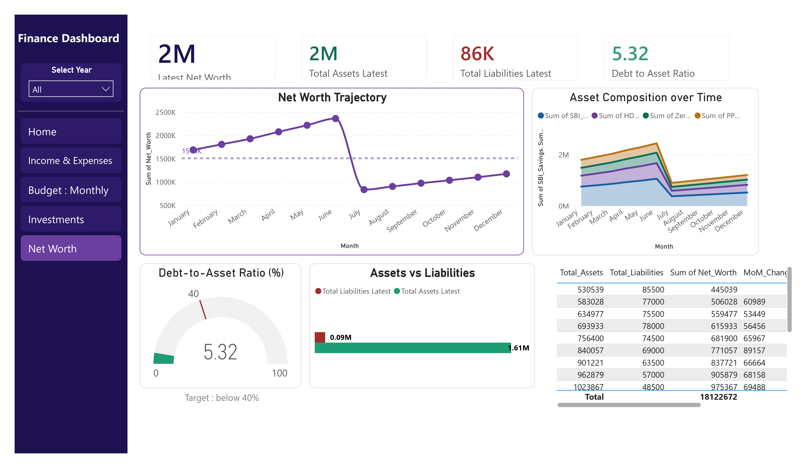

# 📊 Personal Finance Dashboard

> A 5-page interactive Power BI report for end-to-end personal finance tracking : income, expenses, budgets, investments, and net worth.

**Tools:** Power BI Desktop · DAX · Power Query (M) · Excel/CSV  
**Skills demonstrated:** Data modelling · Calculated measures · Conditional formatting · Heatmaps · KPI design · Drill-through filters · Time intelligence

---

## ✨ Highlights

- **5 fully interactive report pages** with cross-page slicers (Year, Month, Category)
- **20+ DAX measures** powering KPIs like Net Savings, Budget Variance, Debt-to-Asset Ratio, Months of Emergency Fund, and Savings Rate %
- **Heatmap matrices** with conditional formatting for spend intensity and budget utilization
- **Gauge visual** for Debt-to-Asset Ratio with a below-40% target
- **Time intelligence** : MoM change, cumulative savings growth, net worth trajectory with target reference lines
- Indian financial instruments covered: SIP (Nifty 50, Mid Cap), ELSS, PPF, FD, CC Outstanding, Personal Loan

---

## 📸 Dashboard Preview

 ### 🏠 Home 
   

 ### 💰 Income & Expenses 
  

 ### 📅 Budget : Monthly 
   

 ### 📈 Investments 
  

 ### 🏦 Net Worth 
  


---

## 📋 Page-by-Page Breakdown

### 🏠 Home
At-a-glance financial health summary.

- **KPIs**: Latest Net Worth · Total Income · Total Expenses · Net Savings
- **Net Worth over Time**: Monthly area chart
- **Recent Transactions**: Scrollable table (Notes, Category, Type, Amount, Date)
- **Asset Allocation**: Donut chart " SBI Savings, HDFC Salary Account, Zerodha, PPF
- **Liabilities Breakdown**: Donut chart : CC Outstanding vs Personal Loan

---

### 💰 Income & Expenses
Income vs expense trends with category-level drill-down.

- **KPIs**: Total Income · Total Expenses · Month-on-Month Change
- **Income vs Expenses Monthly Trend**: Dual-line chart with average reference lines
- **Expense by Category**: Donut : Housing, EMI, Food, Transport, Health, Entertainment, Misc
- **Monthly Spend Heatmap**: Matrix with intensity shading by category × month
- **Top Sub-Categories**: Horizontal bar (Rent, Home Loan EMI, Groceries, Swiggy, Ola, Electricity...)
- **Sidebar slicer**: Category filter

---

### 📅 Budget : Monthly
Budget planning and variance analysis.

- **KPIs**: Budgeted Amount · Total Expenses · Budget Variance · Over-Budget Categories
- **Budget vs Actual by Category**: Grouped horizontal bar chart
- **Variance by Category**: Deviation bar chart (Actual − Budget)
- **Budget Utilization % Heatmap**: Colour-coded matrix of utilization ratios by month × category
- **Sidebar slicer**: Month selector

---

### 📈 Investments
Portfolio breakdown and savings behaviour.

- **KPIs**: Total Investments · SIP Total · Investment % of Income · Months of Emergency Fund
- **Monthly Investment Breakdown**: Stacked bar by instrument (ELSS, FD–SBI, PPF, SIP–Mid Cap, SIP–Nifty 50)
- **Cumulative Savings Growth**: Area chart over time
- **Savings Rate % Monthly Trend**: Line chart with 20% target reference line
- **Investment Transactions Table**: Date, Sub-Category, Amount, Account

---

### 🏦 Net Worth
Full balance sheet with asset/liability decomposition.

- **KPIs**: Latest Net Worth · Total Assets · Total Liabilities · Debt-to-Asset Ratio
- **Net Worth Trajectory**: Line chart with 1.5M target reference line
- **Asset Composition over Time**: Stacked area : SBI Savings, HDFC, Zerodha, PPF
- **Debt-to-Asset Ratio Gauge**: Needle gauge, target below 40%
- **Assets vs Liabilities**: Bar chart comparison
- **Summary Table**: Total Assets, Total Liabilities, Net Worth, MoM Change


---

## 🚀 Guide for using the dashboard yourself

1. Clone the repo:
   ```bash
   git clone https://github.com/Mubashirr101/Personal-Finance-Dashboard.git
   ```
2. Open `personal-finance-tracker.pbix` in **Power BI Desktop** (free : [download here](https://powerbi.microsoft.com/desktop/)).
3. If prompted, update the data source path to your local `finance_data/` folder.
4. Hit **Refresh** and explore.

---
